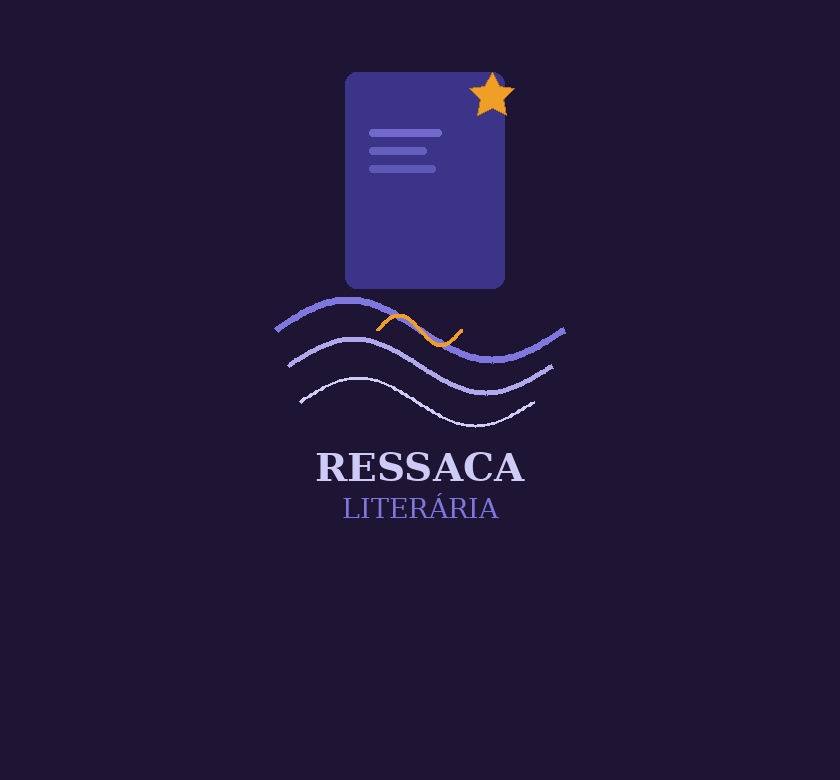

# RessacaLiterariaAPI

Para aquela comunidade que sofre quando o livro acaba.

## Descrição

Comunidade de leitura e biblioteca pessoal integrada com possibilidades de:

- Registrar leituras pessoais
- Escrever resenhas e avaliar livros
- Entrar em grupos de leitura
  - Organizar reuniões
  - Chat para comunicação
  - Painel de informações
    - Progresso de leitura
    - Livro a ser lido
    - Data da próxima reunião
    - Integrantes
- Design gameficado
  - Ganho de xp para incentivar a leitura
  - Sequência de leitura
  - Conquistas
  - Ranking
- Customização de perfil

## Cronograma — Comunidade de Leitura & Biblioteca Pessoal

**Período:** 1 de abril – 1 de dezembro  
**Duração total:** 8 meses

---

### Visão Geral das Fases

| Fase | Nome | Período | Duração |
| ------ | ------ | --------- | --------- |
| 1 | Fundação & Arquitetura | 1 abr – 30 abr | 1 mês |
| 2 | Biblioteca Pessoal | 1 mai – 31 mai | 1 mês |
| 3 | Grupos de Leitura | 1 jun – 31 jul | 2 meses |
| 4 | Gamificação | 1 ago – 30 set | 2 meses |
| 5 | Personalização & Polimento | 1 out – 31 out | 1 mês |
| 6 | QA, Testes & Lançamento | 1 nov – 1 dez | 1 mês |

---

### Fase 1 — Fundação & Arquitetura

#### 1 abr – 30 abr

- Design do banco de dados
- Setup do projeto (Next.js + API)
- Sistema de autenticação
- Wireframes & design system
- Integração com API de livros (Google Books)

---

### Fase 2 — Biblioteca Pessoal

#### 1 mai – 31 mai

- Registro de leituras (lendo, lido, quero ler)
- Busca e adição de livros
- Resenhas e avaliações (1–5 estrelas)
- Progresso de leitura (páginas / %)
- Perfil de usuário básico

---

### Fase 3 — Grupos de Leitura

#### 1 jun – 31 jul

- Criação e busca de grupos
- Chat em tempo real (WebSocket)
- Painel do grupo (progresso, livro atual, próxima reunião)
- Organização de reuniões
- Lista de integrantes & convites

---

### Fase 4 — Gamificação

#### 1 ago – 30 set

- Sistema de XP e níveis
- Sequência de leitura (streak)
- Conquistas / badges
- Ranking global e entre amigos
- Notificações de gamificação

---

### Fase 5 — Personalização & Polimento

#### 1 out – 31 out

- Customização de perfil (avatar, bio, tema)
- Feed de atividades
- Estatísticas pessoais de leitura
- Refinamento de UI/UX

---

### Fase 6 — QA, Testes & Lançamento

#### 1 nov – 1 dez

- Testes de integração e carga
- Correção de bugs
- Deploy em produção
- Beta com usuários reais

---

### Marcos Principais

| Data | Marco |
| ------ | ------- |
| 30 abr | MVP interno — biblioteca pessoal + autenticação funcional |
| 31 mai | Leituras, resenhas e avaliações completos |
| 31 jul | Grupos de leitura com chat em tempo real |
| 30 set | Sistema de gamificação completo (XP, streak, ranking) |
| 1 dez | Lançamento v1.0 em produção |

## Logos

## Protótipos de tela

[Protótipos](https://www.figma.com/site/w5CTcYlxJR1k9ZFl3Wlr7A/Prot%C3%B3tipos-reais?node-id=0-1&t=x0CKbTeV8wJDRNs0-1)

## Requisitos Funcionais

- ### RF01 Cadastro de usuários

O sistema deve permitir que o usuário faça cadastro com email e senha.

- ### RF02 Login e Logout

O sistema deve permitir que o usuário logue no site e saia quando desejar. As informações serão criptografadas no banco de dados.

- ### RF03 Cadastro/Edição/Exclusão de dados(CRUD)

- ### RF04 Geração de relatórios

O sistema deve gerar relatórios e permitir que o usuário acesse os mesmos.

- ### RF05 Busca por informações

O sistema deve permitir que o usuário busque dados no site, como livros, avaliações, comentários, ranking, etc.

- ### RF06 Recuperação de senhas

O sistema deve permitir que o usuário recupere sua senha por meio do email cadastrado, oferecendo as instruções necessárias.

- ### RF07 Sistema de avaliação

O programa deve possuir um espaço para o usuário avaliar conteúdos e comentar.

- ### RF08 Favoritos

O programa deverá permitir que o usuário salve itens como “favoritos”.

- ### RF09 Histórico de atividades

O sistema permitirá que o usuário acesse suas últimas ações feitas na plataforma.

- ### RF10 Ordenação e filtros

O programa permitirá que o usuário filtre e acesse dados por categoria, nota, data, etc.

- ### RF11 Entrar em grupos

O sistema deve permitir que o usuário entre em um grupo público de forma livre, e em privados com uso de senha

- ### RF12 Criar grupos de leitura

O sistema deve garantir que o usuário seja capaz de criar grupos de leitura

- ### RF13 Alterar informações do grupo

O sistema deve permitir a um usuário com permissão suficiente que altere informações como nome do grupo ou estado da leitura atual

- ### RF14 Planejar reuniões

O sistema deve permitir que donos ou administradores de grupos de leitura agendem uma reunião, anunciando para os integrantes na página do grupo da sua ocorrência

## Requisitos não funcionais

- ### RNF01 Desempenho

O tempo de resposta deverá ser, no máximo, até 100 milissegundos.
Deverá ter um suporte máximo de 2000 pessoas acessando simultaneamente.

- ### RNF02 Compatibilidade

O site funcionará em mobile e desktop e, também, será compatível com diferentes navegadores(Chrome, FireFox, etc.)

- ### RNF03 Segurança

O site salvará os dados do usuário(email e senha) no banco de dados.

- ### RNF04 Responsividade

A interface deverá ser adaptável a diferentes tamanhos de tela (notebook, tablet, smartphone)
